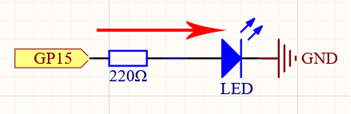
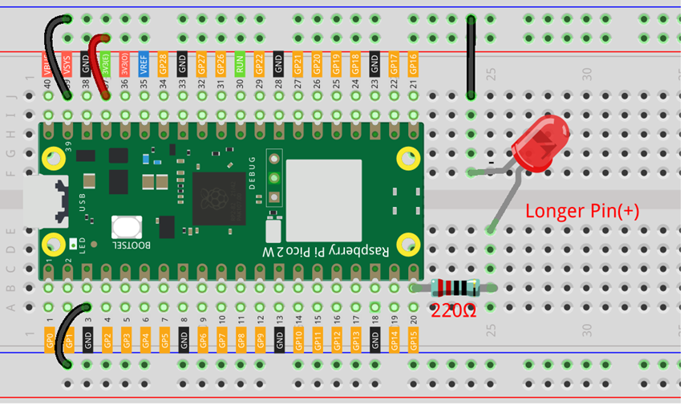

# Blinking Led

Welcome to your first hardware project with the Raspberry Pi Pico !  
In this lesson, we’ll learn how to make an LED blink using MicroPython.   
This simple project is a great way to get started with physical computing   
and understand how to control hardware with code.ertreert

[LED](../../Components/LED/index.md)  

## Required Components

In this project, we need the following components.  

It’s definitely convenient to buy a whole kit, here’s the link: [Kits](https://www.sunfounder.com/collections/pico-w-pico)

You can also buy them separately from the links below.

| SN| Component                                                | Quanity   |
|---|----------------------------------------------------------|-----------|
| 1 | [Pico 2 W](../../Components/Pico%202%20W/index.md)       |    1      |
| 2 | Micro USB Cable                                          |    1      |
| 3 | [Breadboard](../../Components/Breadboard/index.md)       |    1      |
| 4 | [Jumper Wires](../../Components/Jumper%20Wires/index.md) |    1      |
| 5 | [Resistor](../../Components/Resistor/index.md)           | 1 (220 Ω) |
| 6 | [LED](../../Components/LED/index.md)                     |    1      |

## Schematic

  

By setting the GPIO pin high or low, you’re controlling the voltage output of that pin.   
When the pin is high, current flows through the LED (limited by the resistor), causing it   
to light up. When the pin is low, no current flows, and the LED turns off.

## Wiring Diagram



## Code

```python
import machine
import utime

led = machine.Pin(15, machine.Pin.OUT)
while True:
    led.value(1)      # Turn the LED on
    utime.sleep(2)    # Wait for 2 second
    led.value(0)      # Turn the LED off
    utime.sleep(2)    # Wait for 2 second
```

When the code is running, the LED is turn on for 2 second and turn off for 2 second.

## Understanding the Code

1. Importing Libraries:  
* **machine**: Provides access to the hardware components.
* **utime**: Allows us to use time-related functions like delays.

2. Setting Up the LED Pin:
* **led = machine.Pin(15, machine.Pin.OUT)**: Initializes GP15 as an output pin and assigns it to the variable **led**.

3. Creating an Infinite Loop:
* **while True**: Starts an endless loop to continuously run the code inside it.

4. Controlling the LED:
* **led.value(1)**: Sets the pin output to high (3.3V), turning the LED on.
* **utime.sleep(2)**: Pauses the program for 2 second.
* **led.value(0)**: Sets the pin output to low (0V), turning the LED off.
* **utime.sleep(2)**: Pauses the program for another 2 second.

## Experimenting Further

**Change Blink Rate**: Modify the utime.sleep(1) values to make the LED blink faster or slower.  
**Use Different Pins**: Try connecting the LED to a different GPIO pin and update the code accordingly.   
**Multiple LEDs**: Add more LEDs to different pins and control them in your code.   

## Troubleshooting

**LED Not Lighting Up**:  

* Check the orientation of the LED. Ensure the anode and cathode are connected correctly.
* Verify all connections are secure.
* Ensure the resistor is connected in series with the LED.

**Error Messages in VS Code**:  

* Make sure you have selected the correct interpreter.  
* Check for typos in your code.  

## Conclusion

Congratulations! You’ve successfully made an LED blink using the Raspberry Pi Pico and MicroPython.   
This foundational project introduces you to controlling hardware with code, setting the stage for   
more complex projects.