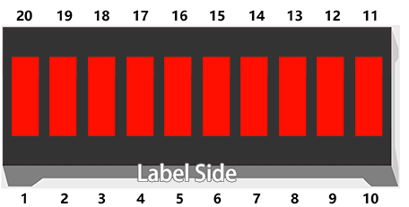
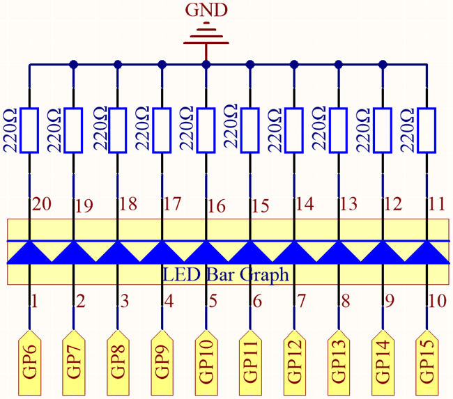
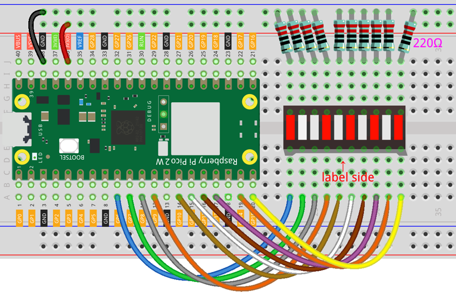

# Led Bar Level

In this lesson, we’ll learn how to control an LED Bar Graph using the   
Raspberry Pi Pico . An LED Bar Graph consists of 10 LEDs arranged in a   
line, typically used to display levels such as volume, signal strength,   
or other measurements. We’ll light up the LEDs sequentially to create a   
level display effect.  

  

[LED Bar Graph](../../Components/LED%20Bar%20Graph/index.md)  

## Required Components

In this project, we need the following components.  

It’s definitely convenient to buy a whole kit, here’s the link:  

| Name                 | Items In This Kit | Link |
|----------------------|-------------------|------|
| Pico 2 W Starter Kit | 450+              | [Pico 2 W Starter Kit](https://www.sunfounder.com/products/sunfounder-raspberry-pi-pico-w-ultimate-starter-kit?_pos=2&_sid=2a4111c2d&_ss=r)  |  

You can also buy them separately from the links below.  

|SN | COMPONENT                                                    | QUANTITY   |
|------------------------------------------------------------------|------------|
| 1 | [Pico 2 W](../../Components/Pico%202%20W/index.md)           |    1       |
| 2 | Micro USB Cable                                              |    1       |
| 3 | [Breadboard](../../Components/Breadboard/index.md)           |    1       |
| 4 | [Jumper Wires](../../Components/Jumper%20Wires/index.md)     |  Several   |
| 5 | [Resistor](../../Components/Resistor/index.md)               | 10 (220 Ω) |
| 6 | [LED Bar Graph](../../Components/LED%20Bar%20Graph/index.md) |    1       |  

## Schematic

  

In this project, each of the 10 LEDs in the LED Bar Graph is connected to the Raspberry Pi Pico 2 W.   
The anodes (positive terminals) of the LEDs are connected to GPIO pins GP6 through GP15. The cathodes   
(negative terminals) are connected through 220Ω resistors to the GND (ground) pin.  

## Wiring Diagram

  


## Code

```python
import machine
import utime

# Define the GPIO pins connected to the LEDs
pins = [6, 7, 8, 9, 10, 11, 12, 13, 14, 15]
leds = []

# Initialize each pin as an output and store it in the leds list
for pin_number in pins:
    led = machine.Pin(pin_number, machine.Pin.OUT)
    leds.append(led)

while True:
    # Turn on LEDs one by one to simulate increasing level
    for led in leds:
        led.value(1)  # Turn the LED on
        utime.sleep(0.2)
    # Turn off LEDs one by one to simulate decreasing level
    for led in leds:
        led.value(0)  # Turn the LED off
        utime.sleep(0.2)
```

When you run the program, the LEDs on the LED Bar Graph will light up sequentially   
from the first to the last, creating an increasing level effect. Then, they will turn   
off one by one, simulating a decreasing level.  

## Understanding the Code

In this project, we control multiple LEDs using lists and loops in MicroPython, which makes   
the code efficient and easy to read.  

Let’s break down the key parts of the code:  

1. Importing Libraries:  
* **machine**: Provides access to the hardware components.
* **utime**: Allows us to use time-related functions like delays.

2. Defining Pins and Initializing LEDs:
* We create a list **pins** containing the GPIO pin numbers connected to the 
  LEDs and initialize an empty list **leds** to store the LED objects.

    ```python
    # Define the GPIO pins connected to the LEDs
    pins = [6, 7, 8, 9, 10, 11, 12, 13, 14, 15]
    leds = []
    ```    

* Using a **for** loop, we iterate over each pin number, set it as an output pin, and   
  append the corresponding **Pin** object to the **leds** list.  

    ```python
    for pin_number in pins:
        led = machine.Pin(pin_number, machine.Pin.OUT)
        leds.append(led)
    ```  

3. Creating the Level Display Effect:
* The **while True:** loop runs indefinitely.
* Increasing Level:
  -  Use a **for** loop to iterate over each **led** in the **leds** list.
  -  **led.value(1)** turns the LED on.
  -  **utime.sleep(0.2)** adds a 200ms delay before the next LED turns on.

    ```python
    for led in leds:
        led.value(1)
        utime.sleep(0.2)
    ``` 

4. Decreasing Level:
* Turn off each LED one by one using another **for** loop.
* **led.value(0)** turns the LED off.
  
    ```python
    for led in leds:
        led.value(0)
        utime.sleep(0.2)
    ``` 

## Experimenting Further
