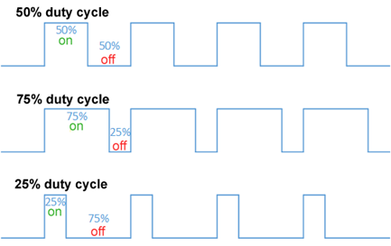
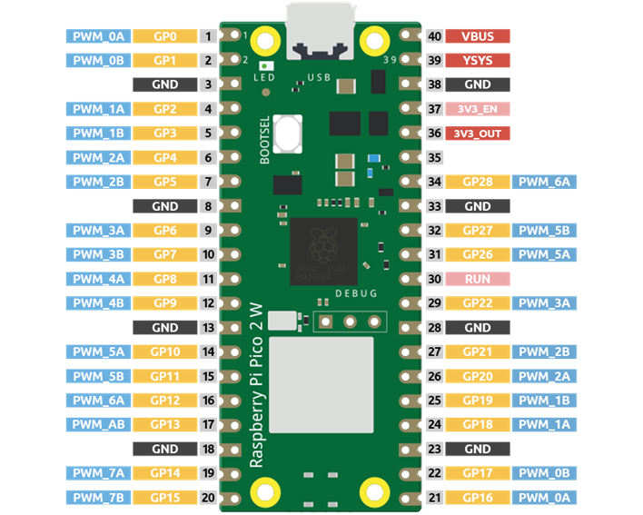
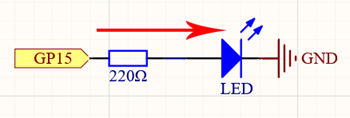
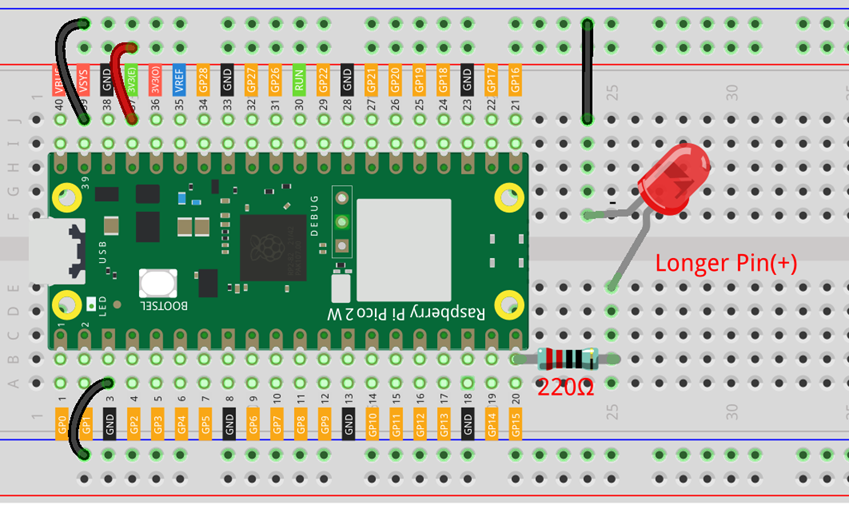

# Fading Led (PWM)

In this lesson, we’ll learn how to control the brightness of an LED using Pulse Width   
Modulation (PWM) on the Raspberry Pi Pico 2 W. This is a fundamental technique in   
electronics that allows us to control devices like LEDs and motors with varying intensities.  

## What is PWM?  

**Pulse Width Modulation (PWM)** is a method of controlling the amount of power delivered to an   
electronic device by cycling the power on and off at a high frequency. The “width” of the pulse   
(the duration it stays on) determines how much power the device receives.  

  

* **Duty Cycle**: The percentage of one period in which a signal is active. A 100% duty cycle means   
  the signal is always on, and 0% means it’s always off.
* **Frequency**: How often the signal cycles on and off per second.  

By adjusting the duty cycle, we can simulate analog output using digital signals. For example, if we   
rapidly turn an LED on and off, our eyes perceive varying brightness levels depending on how long the   
LED stays on during each cycle.  

## Why Use PWM?

* **LED Brightness Control**: Smoothly adjust the brightness of LEDs.
* **Motor Speed Control**: Control the speed of DC motors.
* **Efficiency**: PWM is more efficient than using variable resistors because it reduces energy loss 
  in the form of heat.

## Understanding PWM on the Raspberry Pi Pico 2 W

The Raspberry Pi Pico 2 W has PWM capabilities on all its GPIO pins, but it actually has 8 PWM slices   
(from PWM0 to PWM7), each with two channels (A and B), giving a total of 16 independent PWM outputs.  

**NOTE:**    
Pins sharing the same PWM slice (like GP0 and GP16) cannot have different frequencies but can have   
different duty cycles.  

  

## Required Components

In this project, we need the following components.  

It’s definitely convenient to buy a whole kit, here’s the link: [Kits](https://www.sunfounder.com/collections/pico-w-pico)

You can also buy them separately from the links below.

| SN| Component                                                | Quanity   |
|---|----------------------------------------------------------|-----------|
| 1 | [Pico 2 W](../../Components/Pico%202%20W/index.md)       |    1      |
| 2 | Micro USB Cable                                          |    1      |
| 3 | [Breadboard](../../Components/Breadboard/index.md)       |    1      |
| 4 | [Jumper Wires](../../Components/Jumper%20Wires/index.md) |    1      |
| 5 | [Resistor](../../Components/Resistor/index.md)           | 1 (220 Ω) |
| 6 | [LED](../../Components/LED/index.md)                     |    1      |

## Schematic



## Wiring Diagram



## Code

```python
import machine
import utime

# Set up PWM on pin GP15
led = machine.PWM(machine.Pin(15))
led.freq(1000)  # Set frequency to 1000Hz

# Gradually increase brightness
for duty in range(0, 65536, 64):
    led.duty_u16(duty)  # Set duty cycle (16-bit value)
    utime.sleep(0.01)   # Wait 10ms

# Turn off the LED
led.duty_u16(0)
```  

When the code is running, the LED connected to pin GP15 will gradually increase in   
brightness from off to full brightness.

## Understanding the Code

