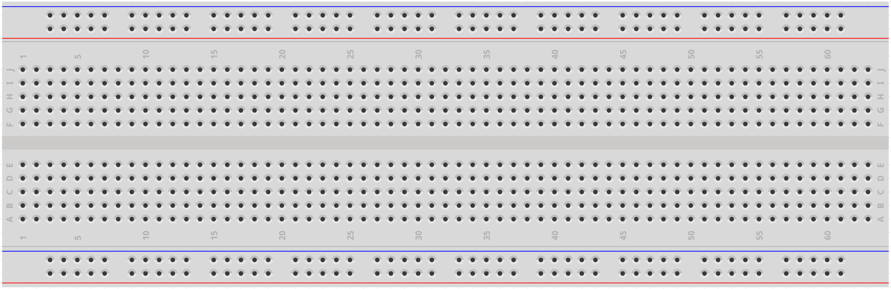

# Breadboard

A breadboard is a platform used for prototyping electronic circuits. The term   
originally referred to a literal breadboard—a polished wooden board used for   
slicing bread. In the 1970s, the solderless breadboard (also known as a plugboard   
or terminal array board) was introduced, and today, the term “breadboard”   
typically refers to this version.  

Breadboards are used to quickly build and test circuits before finalizing a   
design. They feature numerous holes into which components such as ICs, resistors,   
and jumper wires can be inserted. The breadboard’s design allows components to be   
easily plugged in and removed without soldering.  

The image below illustrates the internal structure of a breadboard. While the holes   
on the breadboard appear to be independent, they are internally connected by metal   
strips to facilitate electrical connections.  

  

If you want to know more about breadboard, refer to: [How to Use a Breadboard - Science Buddies](https://www.sciencebuddies.org/science-fair-projects/references/how-to-use-a-breadboard#pth-smd)