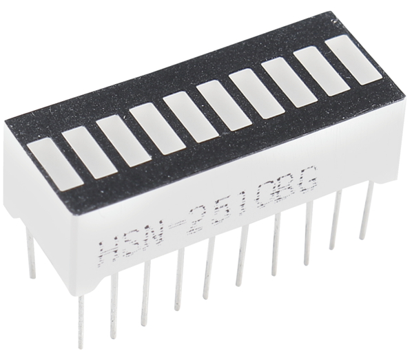
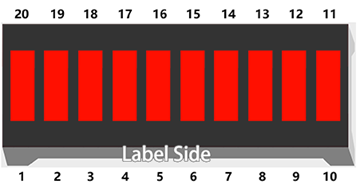
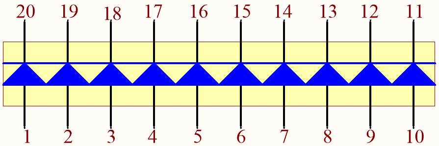

# LED Bar Graph

An LED bar graph is an array of LEDs designed to interface with electronic   
circuits or microcontrollers. Connecting an LED bar graph to a circuit is as   
straightforward as connecting 10 individual LEDs to 10 output pins. LED bar   
graphs are commonly used in applications such as battery level indicators,   
audio equipment, and industrial control panels, among others.  

The diagram below illustrates the internal schematic of an LED bar graph.   
Typically, the side marked with a label represents the anode, while the opposite   
side corresponds to the cathode.  

  
