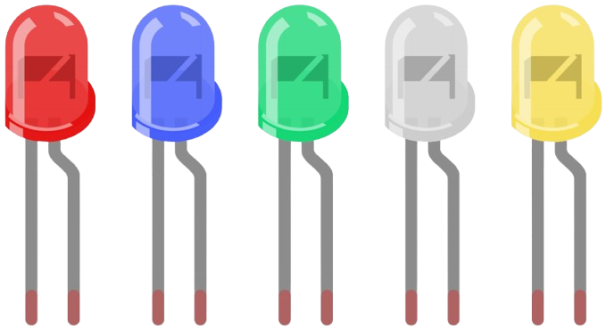

# LED

A semiconductor light-emitting diode is a component that converts electrical energy 
into light energy through a PN junction. Based on wavelength, these diodes can be 
classified into laser diodes, infrared light-emitting diodes, and visible light-emitting 
diodes, commonly referred to as LEDs.  

Due to the diode’s unidirectional conductivity, current flows in the direction indicated 
by the arrow in its circuit symbol. To operate an LED, the anode must be connected to a 
positive power source and the cathode to a negative one, allowing the LED to emit light.  

  

An LED has two pins. The longer one is the anode, and shorter one, the cathode. Pay 
attention not to connect them inversely. There is fixed forward voltage drop in the LED, 
so it cannot be connected with the circuit directly because the supply voltage can outweigh 
this drop and cause the LED to be burnt. The forward voltage of the red, yellow, and green 
LED is 1.8 V and that of the white one is 2.6 V. Most LEDs can withstand a maximum current 
of 20 mA, so we need to connect a current limiting resistor in series.    

The formula of the resistance value is as follows:  

> R = (Vsupply – VD)/I

**R** stands for the resistance value of the current limiting resistor, **Vsupply** for voltage 
supply, **VD** for voltage drop and **I** for the working current of the LED.

Here is the detailed introduction for the LED: [LED - Wikipedia](https://en.wikipedia.org/wiki/Light-emitting_diode).