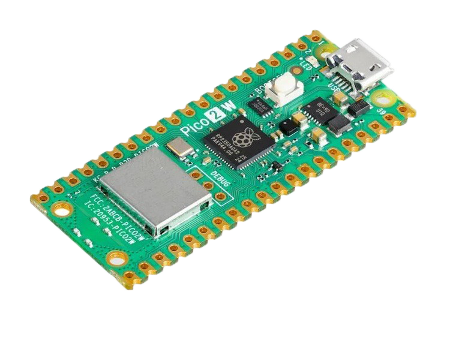

# Pico 2 W

  

Raspberry Pi Pico 2 W features 2.4GHz 802.11n wireless LAN and Bluetooth 5.2,   
giving you even more flexibility in your IoT or smart product designs and expanding   
the possibilities for your projects. It is able to operate in both station andaccess-point   
modes. Full access to network functionality is available to both C andMicroPython developers.    
Raspberry Pi Pico 2 W pairs RP2350 with 4MB of flash memory, and a power supply chip     
supporting input voltages from 1.8–5.5V. It provides 26 GPIO pins, three of which can function     
as analogue inputs, on 0.1”-pitch through-hole pads with castellated edges. Raspberry Pi      
Pico 2 W is available as an individual unit, or in 480-unit reels for automated assembly.  

## Features

- RP2350 microcontroller with 4 MB of flash memory.
- On-board single-band 2.4GHz wireless interfaces. (802.11n, Bluetooth 5.2)
  - Support for Bluetooth LE Central and Peripheral roles.
  - Support for Bluetooth Classic.
- Micro USB B port for power and data. (and for reprogramming the flash)
- 40-pin 21mm×51mm ‘DIP’ style 1mm thick PCB with 0.1” through-hole pins also with edge castellations.
  - Exposes 26 multi-function 3.3V general purpose I/O (GPIO)
  - 23 GPIO are digital-only, with three also being ADC capable.
  - Can be surface-mounted as a module.
- 3-pin Arm serial wire debug (SWD) port.
- Simple yet highly flexible power supply architecture.
  - Various options for easily powering the unit from micro USB, external supplies or batteries.
- 1 × USB 1.1 controller and PHY, with host and device support.
- 3 x Programmable I/O (PIO) blocks, 12 state machines in total.
  - Flexible, user-programmable high-speed I/O.
  - Can emulate interfaces such as SD card and VGA.
- Supported input power 1.8-5.5V DC.
- Operating temperature -20°C to +85°C.
- Castellated module allows soldering direct to carrier boards.
- Drag-and-drop programming using mass storage over USB.
- Accurate on-chip clock.
- Temperature sensor.
- Accelerated integer and floating-point libraries on-chip.

## Pico’s Pins

| Name      | Description                                         | Function                                                                                           |
|-----------|-----------------------------------------------------|----------------------------------------------------------------------------------------------------|
| GP0-GP28  | General-purpose input/output pins                   | Act as either input or output and have no fixed purpose of their own                               |
| GND       | 0 volts ground                                      | Several GND pins around Pico 2 W to make wiring easier.                                            |
| RUN       | Enables or disables your Pico                       | Start and stop your Pico 2 W from another microcontroller.                                         |
| GPxx_ADCx | General-purpose input/output or analog input        | Used as an analog input as well as a digital input or output – but not both at the same time.      |
| ADC_VREF  | Analog-to-digital converter (ADC) voltage reference | A special input pin which sets a reference voltage for any analog inputs.                          |
| AGND      | Analog-to-digital converter (ADC) 0 volts ground    | A special ground connection for use with the ADC_VREF pin.                                         |
| 3V3(O)    | 3.3 volts power                           | A source of 3.3V power, the same voltage your Pico 2 W runs at internally, generated from the VSYS input     |
| 3v3(E)    | Enables or disables the power                       | Switch on or off the 3V3(O) power, can also switches your Pico 2 W off.                            |
| VSYS      | 2-5 volts power       | A pin directly connected to your Pico’s internal power supply, which cannot be switched off without also switching Pico 2 W off. |
| VBUS      | 5 volts power                     | A source of 5 V power taken from your Pico’s micro USB port, and used to power hardware which needs more than 3.3 V. |

The best place to find everything you need to get started with your Raspberry Pi Pico 2 W is [here](https://www.raspberrypi.com/documentation/microcontrollers/pico-series.html)    

Or you can click on the links below:    

- [Raspberry Pi Pico 2 product brief](https://datasheets.raspberrypi.com/pico/pico-2-product-brief.pdf)
- [Raspberry Pi Pico 2 W datasheet](https://datasheets.raspberrypi.com/picow/pico-2-w-datasheet.pdf)
- [Getting started with Raspberry Pi Pico: C/C++ development](https://datasheets.raspberrypi.org/pico/getting-started-with-pico.pdf)
- [Raspberry Pi Pico C/C++ SDK](https://datasheets.raspberrypi.com/pico/raspberry-pi-pico-c-sdk.pdf)
- [API-level Doxygen documentation for the Raspberry Pi Pico C/C++ SDK](https://raspberrypi.github.io/pico-sdk-doxygen/)
- [Raspberry Pi Pico Python SDK](https://datasheets.raspberrypi.com/pico/raspberry-pi-pico-python-sdk.pdf)
- [Raspberry Pi RP2350 datasheet](https://datasheets.raspberrypi.com/rp2350/rp2350-datasheet.pdf)
- [Hardware design with RP2350](https://datasheets.raspberrypi.com/rp2350/hardware-design-with-rp2350.pdf)
- [Raspberry Pi Pico W design files](https://datasheets.raspberrypi.com/picow/RPi-PicoW-PUBLIC-20220607.zip)
- [Raspberry Pi Pico W STEP file](https://datasheets.raspberrypi.com/picow/PicoW-step.zip)