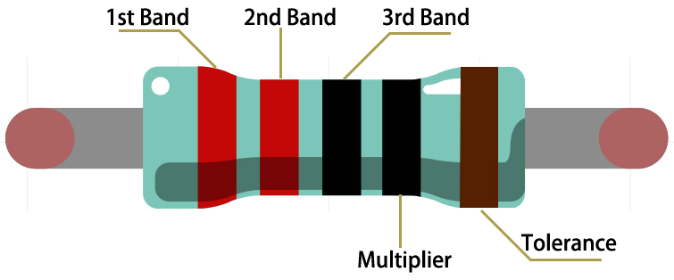

# Resistor

Resistor is an electronic element that can limit the branch current. A fixed resistor   
is a kind of resistor whose resistance cannot be changed, while that of a potentiometer   
or a variable resistor can be adjusted.   

There are two commonly used circuit symbols for resistors, and the resistance value  
is typically indicated on the component. When you encounter these symbols in a circuit   
diagram, they represent a resistor.  

**Ω** is the unit of resistance and the larger units include **KΩ**, **MΩ**, etc.   
Their relationship can be shown as follows:   
1 MΩ=1000 KΩ,   
1 KΩ = 1000 Ω.    
Normally, the value of resistance is marked on it.  

When using a resistor, we need to know its resistance first.   
Here are two methods: you can observe the bands on the resistor,   
or use a multimeter to measure the resistance.   
You are recommended to use the first method as it is more convenient and faster.  

The 4- and 5-band resistors are frequently used, on which there are 4 and 5 chromatic bands.   

Normally, when you get a resistor, you may find it hard to decide which end to start for reading   
the color. The tip is that the gap between the 4th and 5th band will be comparatively larger.      

Therefore, you can observe the gap between the two chromatic bands at one end of the resistor;   
if it’s larger than any other band gaps, then you can read from the opposite side.     

Let’s see how to read the resistance value of a 5-band resistor as shown below.    

   

So for this resistor, the resistance should be read from left to right. The value should be in this   
format: 1st Band 2nd Band 3rd Band x 10^Multiplier (Ω) and the permissible error is ±Tolerance%. So   
the resistance value of this resistor is   
2(red) 2(red) 0(black) x 10^0(black) Ω = 220 Ω, and the permissible error is ± 1% (brown).   

**Common resistor color band**  

| Resistor | Color Band                      |
|----------|---------------------------------|
| 10Ω      | brown black black silver brown  |
| 100Ω     | brown black black black brown   |
| 220Ω     | red red black black brown       |
| 330Ω     | orange orange black black brown |
| 1kΩ      | brown black black brown brown   |
| 2kΩ      | red black black brown brown     |
| 5.1kΩ    | green brown black brown brown   |
| 10kΩ     | brown black black red brown     |
| 100kΩ    | brown black black orange brown  |
| 1MΩ      | brown black black green brown   |

You can learn more about resistor from Wiki: [Resistor - Wikipedia](https://en.wikipedia.org/wiki/Resistor).